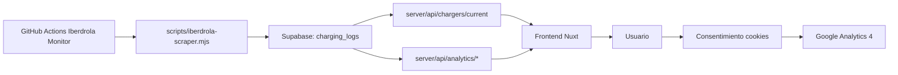

# Estado de Cargadores EV - Ayuntamiento de Aspe

Aplicacion web para monitorizar en tiempo casi real la disponibilidad de cargadores municipales en Aspe, con analitica historica, prediccion, diagnostico operativo y recomendaciones de expansion.

## Enlaces

- Produccion: https://cargadores-aspe.onlineexpansions.com/
- Repositorio: https://github.com/melenas1414/Estado-cargadores-del-ayuntamiento-de-Aspe


## Tabla de contenidos

- [Resumen funcional](#resumen-funcional)
- [Stack tecnico](#stack-tecnico)
- [Arquitectura y flujo de datos](#arquitectura-y-flujo-de-datos)
- [Rutas y SEO](#rutas-y-seo)
- [API disponible](#api-disponible)
- [Estructura del proyecto](#estructura-del-proyecto)
- [Puesta en marcha local](#puesta-en-marcha-local)
- [Variables de entorno](#variables-de-entorno)
- [Automatizacion y despliegue](#automatizacion-y-despliegue)
- [Notificaciones por Telegram (n8n)](#notificaciones-por-telegram-n8n)
- [Scripts npm](#scripts-npm)
- [Troubleshooting](#troubleshooting)
- [Roadmap tecnico](#roadmap-tecnico)
- [Autor](#autor)
- [Licencia](#licencia)

## Resumen funcional

El dashboard incluye:

- Estado actual por cargador (libre, ocupado, parcial).
- Prediccion de liberacion por estacion con nivel de confianza.
- ETA estimada de disponibilidad.
- Duracion media, mediana y p90 de ocupacion.
- Heatmaps por hora y por dia de la semana.
- Salud por cargador (uptime, desconexiones, tiempo offline).
- Deteccion de anomalias y recomendaciones automaticas.
- Diagnostico de saturacion y calidad de datos.
- Ranking operativo y vista de expansion.

## Stack tecnico

| Capa | Tecnologia | Uso principal |
|---|---|---|
| Frontend SSR | Nuxt 3, Vue 3, TypeScript | Dashboard, rutas, SEO y renderizado |
| UI | Tailwind CSS, Lucide, Leaflet, Chart.js | Visualizaciones, mapa y componentes |
| Backend | Nitro (server/api) | Endpoints de estado y analitica |
| Datos | Supabase (PostgreSQL) | Historico, consultas y persistencia |
| Ingesta | Node.js + scraper Iberdrola | Captura periodica de estado de cargadores |
| Orquestacion | GitHub Actions | Scraper automatizado y despliegue |
| Deploy | Vercel | Hosting de la app y runtime server |
| Medicion | Google Analytics 4 | Eventos con consentimiento |

## Arquitectura y flujo de datos



## Rutas y SEO

Rutas principales del dashboard:

- /
- /mapa
- /inteligencia
- /diagnostico
- /expansion

Landings SEO:

- /cargar-coche-electrico-aspe
- /cargadores-gratis-aspe
- /mejores-puntos-recarga-alicante
- /mapa-ev-aspe-tiempo-real

Rutas especiales:

- /charger/[id] para ficha de cargador.
- /admin/insights marcada como noindex,nofollow.
- /resumen redirecciona con 301 a /.

Sitemaps servidos por backend:

- /sitemap.xml
- /sitemap-pages.xml

## API disponible

### Estado actual

- GET /api/chargers/current

### Analitica

- GET /api/analytics/prediction
- GET /api/analytics/eta
- GET /api/analytics/estimated-release
- GET /api/analytics/occupation-duration
- GET /api/analytics/occupancy-by-hour
- GET /api/analytics/occupancy-by-day
- GET /api/analytics/heatmap
- GET /api/analytics/charger-health
- GET /api/analytics/metrics
- GET /api/analytics/diagnostic
- GET /api/analytics/anomalies
- GET /api/analytics/recommendations
- GET /api/analytics/rankings
- GET /api/analytics/expansion-recommendations

## Estructura del proyecto

```text
app/
  components/
  composables/
  pages/
  plugins/
server/
  api/
    analytics/
    chargers/
  routes/
scripts/
  iberdrola-scraper.mjs
  n8n/
supabase/
  schema.sql
  analytics.sql
  timescaledb.sql
  schema/
docs/
.github/workflows/
```

## Puesta en marcha local

### 1) Instalar dependencias

```bash
npm install
```

### 2) Configurar entorno

```bash
cp .env.example .env
```

### 3) Inicializar base de datos (Supabase SQL Editor)

Orden recomendado:

1. supabase/schema.sql
2. supabase/timescaledb.sql
3. supabase/analytics.sql
4. supabase/add-data-quality.sql
5. supabase/cleanup-null-rows.sql
6. supabase/schema/10_charging_logs.sql
7. supabase/schema/20_telegram.sql

### 4) Ejecutar en desarrollo

```bash
npm run dev
```

### 5) Probar build local

```bash
npm run build
npm run preview
```

## Variables de entorno

Variables principales de la app:

| Variable | Obligatoria | Descripcion |
|---|---|---|
| NUXT_PUBLIC_SUPABASE_URL | Si | URL publica del proyecto Supabase |
| NUXT_PUBLIC_SUPABASE_KEY | Si | Clave anon publica de Supabase |
| SUPABASE_SERVICE_KEY | Si | Clave service_role para el backend |
| NUXT_PUBLIC_SITE_URL | Recomendado | URL canonica del sitio |
| NUXT_PUBLIC_GA_ID | Opcional | Measurement ID de GA4 |
| CHARGERS_VISIBLE_STATION_IDS | Opcional | CSV de estaciones visibles en la app |

Variables del scraper:

| Variable | Obligatoria | Descripcion |
|---|---|---|
| SUPABASE_URL | Si | URL de Supabase para escritura del scraper |
| SUPABASE_SERVICE_ROLE_KEY | Si | service_role usada por el scraper |
| SCRAPER_MODE | No | incremental o full |
| SCRAPER_STATION_IDS | No | CSV de estaciones objetivo |
| SCRAPER_PROXY_URL | No | Proxy para peticiones salientes |
| SCRAPER_DEBUG_RESPONSES | No | Debug extendido de respuestas |
| IBERDROLA_LANGUAGE | No | Idioma de peticiones (default: es) |
| IBERDROLA_BBOX_LAT_MAX | No | Bounding box incremental |
| IBERDROLA_BBOX_LAT_MIN | No | Bounding box incremental |
| IBERDROLA_BBOX_LON_MAX | No | Bounding box incremental |
| IBERDROLA_BBOX_LON_MIN | No | Bounding box incremental |
| IBERDROLA_DAILY_BBOX_LAT_MAX | No | Bounding box full diario |
| IBERDROLA_DAILY_BBOX_LAT_MIN | No | Bounding box full diario |
| IBERDROLA_DAILY_BBOX_LON_MAX | No | Bounding box full diario |
| IBERDROLA_DAILY_BBOX_LON_MIN | No | Bounding box full diario |

Variables para integraciones adicionales:

| Variable | Obligatoria | Descripcion |
|---|---|---|
| IBERDROLA_API_URL | No | Endpoint privado Iberdrola (si aplica) |
| IBERDROLA_API_KEY | No | Credencial privada Iberdrola (si aplica) |
| N8N_NOTIFY_WEBHOOK_SECRET | Opcional | Secreto para webhook interno de notificaciones |

## Automatizacion y despliegue

Workflows:

- .github/workflows/iberdrola-monitor.yml
- .github/workflows/deploy.yml

Iberdrola monitor:

- Modo incremental cada 10 minutos, en minutos 7,17,27,37,47,57.
- Modo full diario a las 02:15 UTC.
- Ejecucion manual con workflow_dispatch.

Secrets para monitor:

- SUPABASE_URL
- SUPABASE_SERVICE_ROLE_KEY
- SCRAPER_PROXY_URL (opcional)
- SCRAPER_STATION_IDS (opcional)

Deploy Vercel:

- Trigger por push a main/master en cambios desplegables.
- Runtime Node.js 22 configurado durante el pipeline.

Secrets para deploy:

- VERCEL_TOKEN
- VERCEL_ORG_ID
- VERCEL_PROJECT_ID

## Notificaciones por Telegram (n8n)

El flujo de notificaciones se apoya en n8n y Supabase:

- scripts/n8n/telegram-subscriptions-bot-workflow.json
- scripts/n8n/telegram-notifications-db-workflow.json
- scripts/n8n/iberdrola-supabase-workflow.json

Resumen operativo:

- Se detectan transiciones ocupado -> libre en charging_logs.
- Se envia primero a usuarios prioritarios.
- Tras una espera breve se envia la ola regular.
- Se registra deduplicacion en notification_dispatches.

## Scripts npm

| Script | Descripcion |
|---|---|
| npm run dev | Desarrollo local |
| npm run build | Build de produccion |
| npm run preview | Preview del build |
| npm run generate | Generacion estatica |
| npm run postinstall | Nuxt prepare |

## Troubleshooting

### El scraper falla

1. Revisa SUPABASE_URL y SUPABASE_SERVICE_ROLE_KEY.
2. Activa SCRAPER_DEBUG_RESPONSES=1 para ver respuestas.
3. Si hay bloqueo remoto, prueba SCRAPER_PROXY_URL.

### No hay despliegue tras push

1. Comprueba si tus cambios entran en paths monitorizados por deploy.yml.
2. Verifica VERCEL_TOKEN, VERCEL_ORG_ID y VERCEL_PROJECT_ID.

### GA4 no registra eventos

1. Verifica NUXT_PUBLIC_GA_ID.
2. Acepta cookies en el banner.
3. Comprueba en DevTools la carga de gtag.

## Roadmap tecnico

Referencia de evolucion del producto:

- docs/plan-desarrollo.md
- docs/tesla-analytics.md
- docs/notificaciones-web-push.md

## Autor

- Nombre: Santiago Galan
- Email: santiagogalan13@gmail.com
- GitHub: https://github.com/melenas1414
- LinkedIn: https://linkedin.com/in/santiago-galan-tapias
- Twitter: https://twitter.com/melenas1414
- Web: https://onlineexpansions.com

## Licencia

MIT