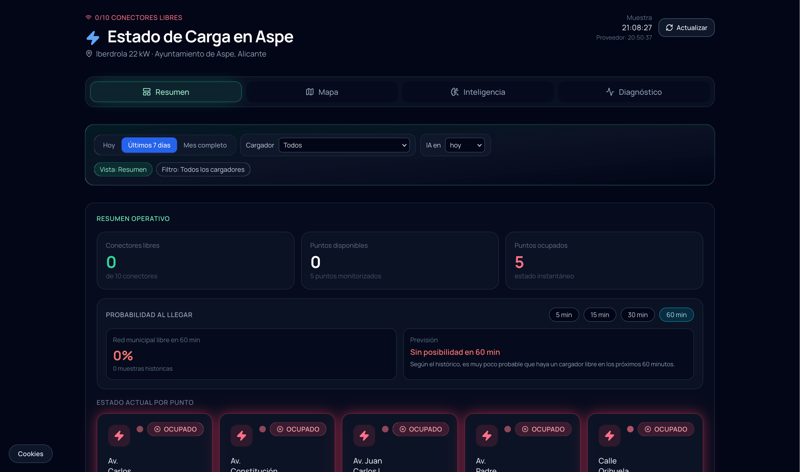
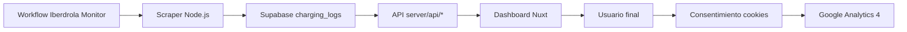

# Estado de Cargadores EV - Ayuntamiento de Aspe

Aplicacion web para monitorizar en tiempo casi real la disponibilidad de cargadores municipales en Aspe, con analitica historica, prediccion y diagnostico.

<p align="center">
  <a href="https://cargadores-aspe.onlineexpansions.com/"></a>
  <a href="https://cargadores-aspe.onlineexpansions.com/"></a>
  <a href="https://github.com/melenas1414/Estado-cargadores-del-ayuntamiento-de-Aspe"></a>
</p>

<p align="center">
  
  
  
  
  
</p>

<p align="center">
  <a href="#5-puesta-en-marcha-desde-cero"></a>
  <a href="#6-variables-de-entorno"></a>
  <a href="#7-github-actions"></a>
  <a href="#9-cookies-y-google-analytics"></a>
</p>

## Vista de ejemplo



## 1) Tecnologia

| Capa | Tecnologia | Uso |
|---|---|---|
| Frontend SSR | Nuxt 3 + Vue 3 | Renderizado, rutas y UI del dashboard |
| Estilos | Tailwind CSS | Sistema visual y componentes |
| Backend app | Nitro (server/api) | Endpoints de estado, heatmap, prediccion y diagnostico |
| Base de datos | Supabase (PostgreSQL) | Persistencia de lecturas y consultas analiticas |
| Automatizacion de ingesta | GitHub Actions + Node.js | Ejecucion del scraper de Iberdrola |
| Deploy | GitHub Actions + Vercel | Build y despliegue de produccion |
| Analitica web | Google Analytics 4 + Consent Mode avanzado | Medicion bajo consentimiento |

## 2) Cuentas necesarias y como crearlas

GitHub se usa para ejecutar las actualizaciones automaticas mediante GitHub Actions.

### Cuenta de Supabase

Se necesita para la base de datos y acceso API.

1. Crear cuenta en https://supabase.com/.
2. Crear proyecto nuevo.
3. Obtener en Settings > API:
   - Project URL
   - anon key
   - service_role key

### Cuenta de Vercel

Se necesita para el hosting del frontend.

1. Crear cuenta en https://vercel.com/.
2. Crear/importar proyecto.
3. Obtener:
   - VERCEL_TOKEN (Account Settings > Tokens)
   - VERCEL_ORG_ID
   - VERCEL_PROJECT_ID

### Cuenta de Google Analytics (opcional, recomendada)

Se necesita para analitica del panel.

1. Crear propiedad en Google Analytics 4.
2. Crear flujo Web.
3. Copiar Measurement ID (formato G-XXXXXXX).

## 3) Funcionalidad principal

- Estado actual por punto de carga (libre/ocupado/parcial).
- Probabilidad al llegar y ETA por ventanas de tiempo.
- Heatmap de ocupacion por dia/hora.
- Prediccion por horizonte temporal.
- Diagnostico operativo de saturacion y calidad de datos.
- Navegacion por rutas SEO: /, /mapa, /inteligencia, /diagnostico.
- Banner de cookies propio con consentimiento granular para GA4.

## 4) Flujo funcional



## 5) Puesta en marcha desde cero

### Paso 1: Clonar e instalar

```bash
git clone https://github.com/melenas1414/Estado-cargadores-del-ayuntamiento-de-Aspe.git
cd Estado-cargadores-del-ayuntamiento-de-Aspe
npm install
```

### Paso 2: Inicializar Supabase con todos los SQL

Ejecuta estos scripts en el SQL Editor de Supabase en este orden:

1. supabase/schema.sql
2. supabase/timescaledb.sql
3. supabase/analytics.sql
4. supabase/add-data-quality.sql
5. supabase/cleanup-null-rows.sql

### Paso 3: Configurar entorno local

```bash
cp .env.example .env
```

Rellena los valores obligatorios de la seccion Variables de entorno.

### Paso 4: Ejecutar en local

```bash
npm run dev
```

Aplicacion local: http://localhost:3000

### Paso 5: Build de produccion local (opcional)

```bash
npm run build
npm run preview
```

## 6) Variables de entorno

### Variables de app (Nuxt)

| Variable | Obligatoria | Ambito | Descripcion |
|---|---|---|---|
| NUXT_PUBLIC_SUPABASE_URL | Si | Cliente/Servidor | URL publica del proyecto Supabase |
| NUXT_PUBLIC_SUPABASE_KEY | Si | Cliente/Servidor | Clave anon de Supabase |
| NUXT_PUBLIC_SITE_URL | Si | Cliente/Servidor | URL publica canonica |
| NUXT_PUBLIC_GA_ID | Recomendado | Cliente/Servidor | Measurement ID GA4 |
| SUPABASE_SERVICE_KEY | Si | Servidor | service_role para endpoints server-side |
| IBERDROLA_API_URL | No | Servidor | Reserva para integracion privada |
| IBERDROLA_API_KEY | No | Servidor | Reserva para integracion privada |

### Variables del scraper

| Variable | Obligatoria | Descripcion |
|---|---|---|
| SUPABASE_URL | Si | URL de Supabase usada por el scraper |
| SUPABASE_SERVICE_ROLE_KEY | Si | service_role key para escritura |
| SCRAPER_MODE | No | incremental o full |
| IBERDROLA_LANGUAGE | No | Idioma, por defecto es |
| SCRAPER_PROXY_URL | No | Proxy HTTP/HTTPS |
| SCRAPER_DEBUG_RESPONSES | No | Logging extendido (1/true) |
| IBERDROLA_BBOX_LAT_MAX | No | Bounding box incremental |
| IBERDROLA_BBOX_LAT_MIN | No | Bounding box incremental |
| IBERDROLA_BBOX_LON_MAX | No | Bounding box incremental |
| IBERDROLA_BBOX_LON_MIN | No | Bounding box incremental |
| IBERDROLA_DAILY_BBOX_LAT_MAX | No | Bounding box full diario |
| IBERDROLA_DAILY_BBOX_LAT_MIN | No | Bounding box full diario |
| IBERDROLA_DAILY_BBOX_LON_MAX | No | Bounding box full diario |
| IBERDROLA_DAILY_BBOX_LON_MIN | No | Bounding box full diario |

## 7) GitHub Actions

El proyecto usa estos workflows:

- .github/workflows/iberdrola-monitor.yml
- .github/workflows/deploy.yml

### Iberdrola Monitor

- Incremental: cada 10 minutos (7,17,27,37,47,57).
- Full diario: 02:15 UTC.
- Manual: workflow_dispatch con mode incremental o full.

Secrets requeridos:

| Secreto | Obligatorio |
|---|---|
| SUPABASE_URL | Si |
| SUPABASE_SERVICE_ROLE_KEY | Si |
| SCRAPER_PROXY_URL | No |

### Deploy

El deploy se lanza en push a master/main solo si cambian rutas desplegables configuradas en .github/workflows/deploy.yml.

Secrets requeridos:

| Secreto | Obligatorio |
|---|---|
| VERCEL_TOKEN | Si |
| VERCEL_ORG_ID | Si |
| VERCEL_PROJECT_ID | Si |

## 8) Configuracion en Vercel

Configura en Vercel (Production y Preview cuando aplique):

- NUXT_PUBLIC_SUPABASE_URL
- NUXT_PUBLIC_SUPABASE_KEY
- NUXT_PUBLIC_SITE_URL
- NUXT_PUBLIC_GA_ID
- SUPABASE_SERVICE_KEY
- IBERDROLA_API_URL (si se usa)
- IBERDROLA_API_KEY (si se usa)

## 9) Cookies y Google Analytics

- Banner de consentimiento propio.
- Consent Mode avanzado.
- Consentimiento por defecto denegado para ad_storage, ad_user_data, ad_personalization y analytics_storage.
- Actualizacion de consentimiento a granted o denied segun accion del usuario.
- Eventos solo cuando hay consentimiento aceptado.

## 10) Cargadores monitorizados

| Station ID | Ubicacion |
|---|---|
| ESIBE22E0001001 | Av. Carlos Soria, 11, Aspe |
| ESIBE22E0001002 | Av. Constitucion 42, Aspe |
| ESIBE22E0001003 | Av. Padre Ismael 34, Aspe |
| ESIBE22E0001004 | Av. Juan Carlos I 36, Aspe |
| ESIBE22E0001005 | Calle Orihuela 100, Aspe |

## 11) Estructura del proyecto

```text
app/
  app.vue
  components/
  composables/
  pages/
  plugins/
server/
  api/
  routes/
scripts/
  iberdrola-scraper.mjs
supabase/
  schema.sql
  timescaledb.sql
  analytics.sql
  add-data-quality.sql
  cleanup-null-rows.sql
.github/workflows/
  deploy.yml
  iberdrola-monitor.yml
public/
  dashboard.png
```

## 12) Scripts npm

| Comando | Descripcion |
|---|---|
| npm run dev | Desarrollo local |
| npm run build | Build de produccion |
| npm run preview | Preview de build |
| npm run generate | Generacion estatico |

## 13) Troubleshooting rapido

### Google Analytics no registra

1. Verifica NUXT_PUBLIC_GA_ID en Vercel.
2. Acepta cookies en el banner.
3. Comprueba en DevTools que existe gtag/js?id=...
4. Revisa bloqueo por adblockers.

### No se despliega tras push

Revisa si el cambio afecta rutas incluidas en filtros de .github/workflows/deploy.yml.

### Falla el scraper

1. Revisar SUPABASE_URL y SUPABASE_SERVICE_ROLE_KEY.
2. Probar con SCRAPER_PROXY_URL si hay bloqueo.
3. Lanzar workflow_dispatch en modo full.

## Autor

- Nombre: Santiago Galan
- Email: santiagogalan13@gmail.com
- GitHub: https://github.com/melenas1414
- LinkedIn: https://linkedin.com/in/santiago-galan-tapias
- Web: https://onlineexpansions.com

## Licencia

MIT